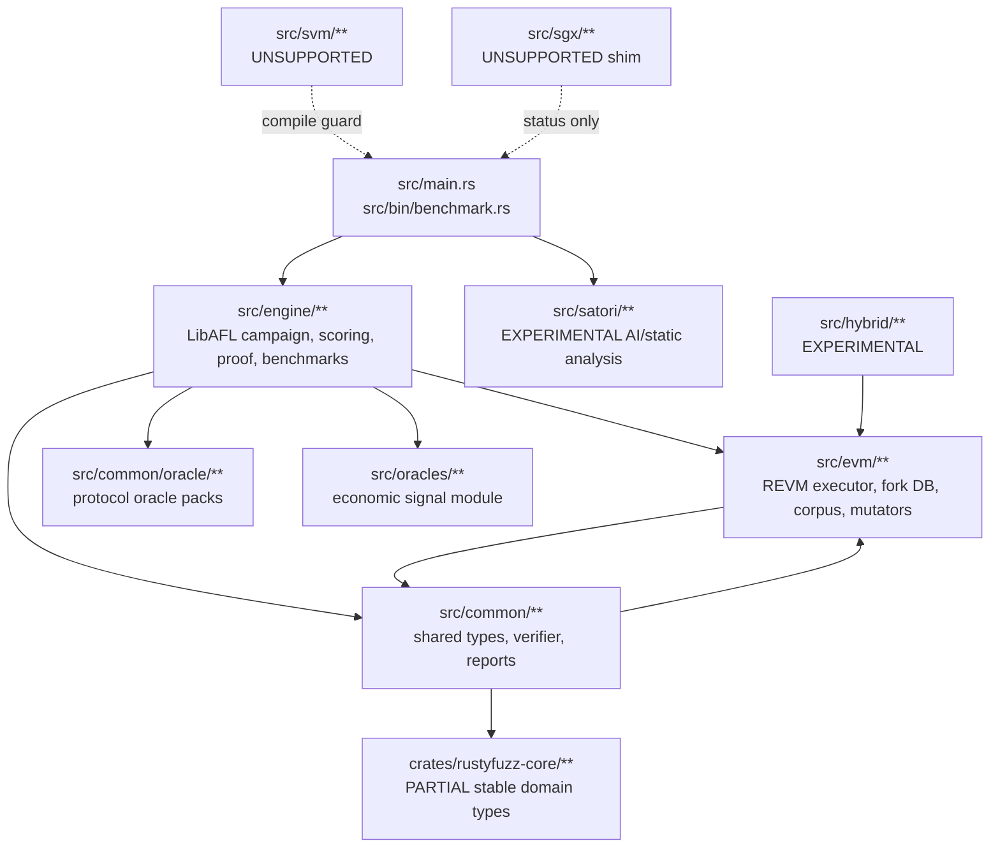
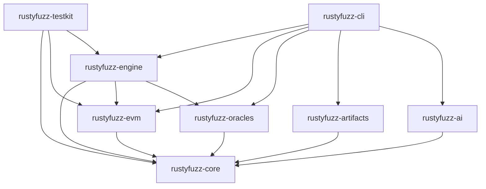

# RustyFuzz Architecture

Status: CURRENT and TARGET reference.

This document separates the current v0.1 monolith from the approved v0.2 target.
Target sections describe migration intent only; they are not claims about code
that exists today. Stage 2A has introduced the first workspace member,
`rustyfuzz-core`, but the runtime is still the existing monolith.

## Current Architecture - v0.1

RustyFuzz is currently a Cargo workspace with two members:

- the existing package named `rusty-fuzz`;
- `crates/rustyfuzz-core`, a dependency-light domain crate introduced in Stage
  2A.

The default and supported production path is still EVM. The current
`rusty-fuzz` package contains REVM execution, LibAFL campaign orchestration,
protocol oracles, artifact persistence, benchmark orchestration, CLI command
handling, and Satori research tooling in one crate.

Main current boundaries:

- `src/main.rs`: CLI parsing and command execution; currently larger than a thin dispatcher.
- `src/bin/benchmark.rs`: benchmark child-process runner.
- `crates/rustyfuzz-core/**`: PARTIALLY IMPLEMENTED stable IDs, neutral
  metadata skeletons, typed core errors, and the dependency-neutral
  `ExecutionStatus`.
- `src/common/**`: shared execution/finding/report/verifier types, but still depends on REVM and EVM modules.
- `src/evm/**`: REVM executor, fork DB, snapshots, corpus, ABI-aware mutation, traces, and feedback.
- `src/engine/**`: LibAFL campaign runtime, scheduler, scoring, benchmark validation, seed intelligence, concolic hints, minimization, promotion, and proof support.
- `src/common/oracle/**` and `src/oracles/**`: overlapping oracle/economic signal implementations.
- `src/satori/**`: experimental AI/static-analysis workflow.
- `src/hybrid/**`: experimental taint/differential components.
- `src/svm/**`: intentionally unsupported SVM prototype.
- `src/sgx/**`: unsupported SGX status shim.

Current high-level dependencies:



Known current architecture problems:

- Stage 2B (CURRENT): `EvmInput` is semantic-only (`txs`, `base_snapshot_id`);
  waypoints/provenance live in `EvmTestcaseMetadata` and a temporary
  `EvmTestcaseMetadataStore` sidecar. Remaining debt: the store should become
  native LibAFL testcase/state metadata (TODO(stage-4)).
- `common` is not core-clean because it imports REVM and `evm::fork_db`; only
  selected neutral types have been bridged to `rustyfuzz-core`.
- There are duplicate finding lifecycle models in source and older docs.
- Runtime paths are reconstructed in multiple modules; there is no `RunLayout`.
- Stage 2C (CURRENT): snapshot identity explicit (assigned ids vs
  `StateFingerprint` content digests), ancestry with cycle guards,
  versioned snapshot manifests; selection/scheduler policy untouched.
- Satori is useful but coupled to one provider path and runtime layout.
- SVM and SGX are not production backends.

## Target Architecture - v0.2

The v0.2 target is an EVM-only supported production kernel with a staged
workspace extraction. Stage 2A has implemented only the first core crate
boundary.

Target crates:

- `rustyfuzz-core`: PARTIALLY IMPLEMENTED. Currently owns strong IDs, typed
  core errors, neutral snapshot/testcase metadata skeletons, evidence
  references, and `ExecutionStatus`. Target scope also includes stable inputs,
  execution observations, snapshots, findings, and metadata. No REVM, LibAFL
  internals, RPC clients, AI SDKs, or CLI framework dependencies.
- `rustyfuzz-evm`: TARGET. REVM backend, fork DB, ABI handling, bytecode analysis, inspectors, traces, lazy RPC state, and EVM state representation.
- `rustyfuzz-engine`: TARGET. LibAFL campaign builder/runtime/worker, feedback, mutators, scheduler, snapshots, seeds, concolic, minimization, and proof orchestration.
- `rustyfuzz-oracles`: TARGET. Oracle traits, evidence, and production oracle packs.
- `rustyfuzz-artifacts`: TARGET. Versioned runtime layout, manifests, persistence queue, reports, and schema round trips.
- `rustyfuzz-ai`: TARGET. Optional provider-neutral AI proposal subsystem.
- `rustyfuzz-cli`: TARGET. Thin command parser and dispatcher.
- `rustyfuzz-testkit`: TARGET. Deterministic fixtures and shared test helpers.

Target dependency direction:



Rules for the target:

- No upward dependencies.
- No circular re-exports.
- No fake multi-chain abstraction until at least two production backends exist.
- EVM is the only supported production backend.
- Unsupported SVM/SGX code is quarantined outside the supported dependency graph.
- AI proposes; RustyFuzz validates.

## Runtime Root

Target runtime root:

```text
.rustyfuzz/
  runs/
  cache/
  datasets/
  tmp/
```

Future campaign layout:

```text
.rustyfuzz/
  runs/
    <run-id>/
      manifest.json
      config.json
      inputs/
      snapshots/
      candidates/
      rejected/
      proved/
      minimized/
      fork-cache/
      reports/
      telemetry/
      ai/
```

Stage 1 only documents this layout and updates ignores. It does not implement
`RunLayout` or migrate production artifact-writing code.
